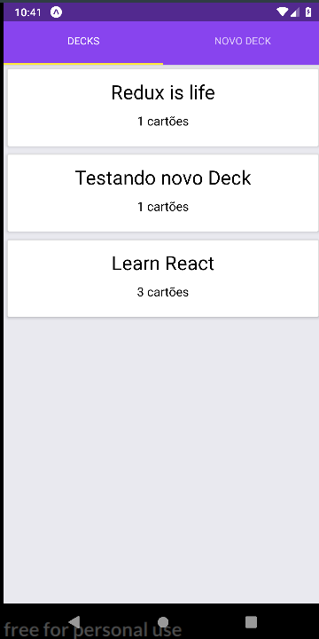

Este projeto foi criado com o [Create React Native App](https://facebook.github.io/react-native/blog/2017/03/13/introducing-create-react-native-app).

## Manual de Instalação

Na diretorio do projeto execute:  
`yarn install` para instalar as dependencias    

`yarn start` para executar a aplicação 

## Sobre o Projeto

O projeto Flashcards é um projeto solicitado no terceiro modulo do nanodegree de desenvolvimento em React, o modulo de desenvolvimento em React-Native

 Tecnologias Utilizadas no Projeto. 

<ul>
  <li>React-Native</li>
  <li>Redux</li>
</ul>

<b>Projeto FlashCards </b>

  

  

 Você pode ler mais sobre o create react native app em  [Create React App documentation](https://facebook.github.io/react-native/blog/2017/03/13/introducing-create-react-native-app).

## Referências
[React Native documentation](https://facebook.github.io/react-native/blog/2017/03/13/introducing-create-react-native-app).  
[Stackoverflow](https://pt.stackoverflow.com/).  
Comunidade do Nanodegree no Slack.